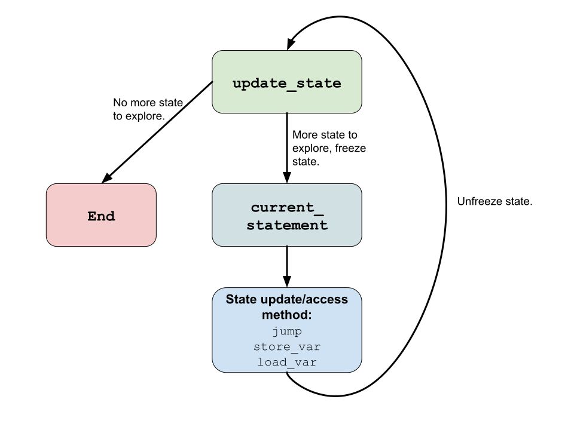

# YouVerify

YouVerify is a simple imperative programming language based on the SMT-LIB set of theories and operators as a foundation. The YouVerify symbolic execution framework provides a symbolic execution engine on the YouVerify language, with the intention that all operators and code written with the YouVerify language can be symbolically executed using the companion symbolic execution engine. The symbolic execution engine exposes a comprehensive API allowing developers to prototype application specific symbolic execution algorithms. 

YouVerify requires **Python3**.

## Running and Using YouVerify:

### Setup

Clone the repository:

`git clone https://github.com/gprechter/youverify.git`

Navigate to the cloned folder:

`cd youverify`

First, create a python virtual environment:

`python3 -m venv venv`

Then, activate the virtual environment any time you want to use YouVerify:

`source venv/bin/activate`

(ONLY the first time you install YouVerify) Next, install the dependencies:

`python -m pip install -r requirements.txt`

### Running YouVerify

Run a file using YouVerify:

`python src/YouVerify.py --f tests/comprehensive.yvr`

After YouVerify finishes running, the output of the run will be in the `out/<FILE NAME>` folder. In our case, go to:

`cd out/comprehensive.yvr/`

In there, there will be folders for each of the resulting program states after symbolic execution. Navigate to one of the numbered folders:

`cd 12`

Inside the folder you should find: `12.trace`, `12.state`, `12.pickle` (this final file is a binary used by YouVerify).

The beginning of the `12.trace` file should look something like this, this file contains the trace of the execution path for that state:

```
0
1
2
call below_max_length
	0
	1
	2 LOOP
...
```
The `12.state` file should look something like this (**NOTE:** the values may differ — depending on your SMT solver), this file shows the symbolic inputs synthesized by the SMT solver along with the values of the global variables at the end of the program execution:

```
SYMBOLIC INPUTS:

FV0 <- 5
level <- Array{Int, BV{8}}(...)[3 := 0_8][0 := 16_8][4 := 5_8][2 := 69_8]
buttons <- Array{Int, Bool}(False)[1 := True]
FV1 <- 3

FINAL PROGRAM STATE:

buttons: []->[False, True, False]
level: []->[16_8, 10_8, 69_8, 0_8, 5_8]
max_level_length: 5
is_below_max_length: True
level_sum: 100
final_score: 85_16
```

### Plugging Inputs into YouVerify and Running Concretely

Return to the top level directory:

`cd ../../..`

Use the following command to *plug in* state **12** and re-run the same program concretely:

`python src/YouVerify.py --f tests/comprehensive.yvr --input 12`

The final program state will be printed out in the console and should match the one found in the ouput from the symbolic execution:

```
buttons: []->[False, True, False]
level: []->[16_8, 10_8, 69_8, 0_8, 5_8]
max_level_length: 5
is_below_max_length: True
level_sum: 100
final_score: 85_16
```

## DEMO VIDEO

[**DEMO**](https://youtu.be/jiDrGJQbbFw)

## Language Features

Each `YouVerify` program (file extension `.yvr`) is composed as follows, divided into two sections:

```
<GLOBAL DECLARATIONS>
...
<STATEMENTS>
...
```

At the top of the program file, there are the global definitions consisting of **global variable declarations** along with **function declarations**, and **record type declarations**. Functions can only be declared globally. Below all of the declarations are the statements, or the body of the program. 

### Variable Declarations

```
x: INT						# Integer type declaration
b: BOOL						# Boolean type declaration
bv: BV[32]				# A bit vector of length 32 bits
arr: ARRAY{INT}		# Array type declaration of array with integer elements
rec: point  		  # record type declaration
```

A variable declaration is written using the following syntax:

```
<variable name> : <built-in sort | custom record type>
```

### Built-in Sorts and Custom Record Types

Values can be typed as either built-in sorts (those that are supported by the underlying SMT-LIB 2 sorts), or using custom record types, which provide a type that contains multiple built-in sort typed values.

#### Built-in Sorts

The current supported built-in sorts are: `INT`, `BOOL`, `BV`, `ARRAY`. Array types are associated with another type known as the *element type*; this type can be any other *built-in sort*, including `ARRAY`.

#### Custom Record Types

A record type is created as follows:

```
record point(x: INT, y: INT)
```

### Functions:

Functions are defined as follows:

```
define <function-name> ( <variable declarations as parameters> ) [-> <return type>]:
		<LOCAL DECLARATIONS [VARIABLES ONLY]>
		...
		<STATEMENTS>
		...
```

Functions can take in any amount of parameters, represented using variable declaration notation in the parentheses. Functions can optionally have a return type. If a function has a return type, all paths through the funciton ***must*** terminate in a return statement returning the corresponding type. If the function has no return type, it must terminate without returning a value.

Within the body of the function, like at the global level, all local declarations must come first. Following the local declarations, the statements that make up the body of the function is written.

##### Example:

```
define fact(n: INT) -> INT:
		rec_call: INT
		next_n: INT
		if n > 0 goto END
		return 1
		LABEL END: next_n = n - 1
		call rec_call = fact(next_n)
		return rec_call * n
```

### Statements

Below the delcarations and definitions above, there are the statements that make up the body of the program or function.

#### Labeled Statements

Every statement can optionally be labeled: `LABEL <LABEL_NAME>: <STATEMENT>`. Every labeled statement is made available as a branch destination to be used by conditional and unconditional branching statements. Within a given scope (i.e. global, function local), there **must** not be duplicate label names. That is, each statement that is labeled within a scope must have a unique name.

#### Assignment Statements

The most basic statement is the assignment statement which is written as follows:

```
<ASSIGNMENT TARGET> = <EXPRESSION>
```

The right hand side of an assign statement can be any valid expression, so long as it evaluates to the same type as the assignment target.

The ***assignment target*** can be one of the following three:

1) An identifier which corresponds to a variable. `x = 10`

2) An array index expression, which corresponds to storing into a certain index in an array: `arr[10] = 10`

3) A record index expression, which corresponds to assigning to an element in a record: `rec.x = 10`

#### Branching Statements

There are two flavors of branching statements **conditional** and **unconditional**.

##### Conditional Branching Statements

A conditional branch statement depends on a condition and will either increment the program counter by one to the next statement if the condition is false and will set the program counter to the line number of the labeled expression if the condition is true. The conditional expression can be any valid expression that evaluates to the `BOOL` sort.

```
if <CONDITIONAL EXPRESSION> goto <LABEL NAME>
```

##### Unconditional Branching Statement

The unconditional branching statement is a short hand way of writting `if true goto <LABEL NAME>`:

```
goto <LABEL NAME>
```

#### Function Call Statements

A function call is expressed not as an expression but rather as it's own individual statement. There are two flavors of the funciton call statement, the first is if the function call return value is supposed to be assigned to a variable in the caller frame, and the second is if the function call return value is **not** supposed to assign to a variable in the caller frame.

##### Function Call then Assign Statement

```
call <ASSIGNMENT TARGET> = <FUNCTION NAME> ( <ARGUMENTS> )
```

**note:** *only* functions that have a return value of the appropriate type can be used in a call then assign statement.

##### Function Call with No Assign Statement

```
call <FUNCTION NAME> ( <ARGUMENTS> )
```

Any function can be called using this notation.

#### Return Statements [*Funcitons Only*]

Depending on the desired behavior, a return statement can either have a value to return or not. 

```
return
```

```
return x
```

A return statement without a return value can be used to return from a function without a declared return type. If a function has a return type, the return statement with a value of the corresponding type must be used.

#### Assert Statements

An assert statement is utilized by appending a given condition to the path constraint, acting as a conditional branching statement branching to the end of the program. The statement following the `assert` keyword must evaluate to the `BOOL` sort.

```
assert <CONDITIONAL EXPRESSION>
```

### Expressions

Expressions are utilized in the many types of statements:

#### Atomic Expressions

There are a few atomic expressions that consist of the following categories:

##### Concrete Values:

```
10 							# Value of type INT sort
true						# Value of type BOOL sort
false 					# Value of type BOOL sort
BV{4, 32}				# Value of type BV sort, with value and length 
ARRAY[]{INT} 		# An ARRAY sort of integers with indefinite length
ARRAY[10]{INT}	# An ARRAY sort of integers with a fixed length of 10
```

##### Variable Identifier

```
x
b
point
factorial_value
```

##### Symbolic Values:

````
$sym{BOOL}		# A symbolic value of sort BOOL with a random unique name
$sym{b, BOOL}	# A symbolic value of sort BOOL with the name 'b'
````

**note:** symbolic values, every time an atomic expression with no name is evaluated a NEW symbol with a unique name is created.

#### Array Index Expressions

```
arr[<INDEX>]	# Where INDEX must be an integer sort, and must be within bounds
```

#### Record Element Index Expression

```
<variable name> . <element name>
```

#### Unary Expressions

```
<UNARY OPERATOR> <ATOMIC EXPRESSION>
```

#### Binary Expressions

```
<ATOMIC EXPRESSION> <BINARY OPERATOR> <ATOMIC EXPRESSION>
```

#### Ternary Expressions

Only `ite`.

```
<ATOMIC EXPRESSION> ? <ATOMIC EXPRESSION> : <ATOMIC EXPRESSION>
```

## API

The YouVerify framework comes packaged with an API consisting primarily of an abstract state object that is to be implemented and modified by developers to pototype symbolic execution modifications and algorithms. The API is invoked by the framework in the following manner:



First, the `update_state` method is invoked by the framework. This tells the abstract state implementation to prepare the state representation and *freeze* it, not changing it until the method is called again.


You can view the API documentation on GitHub [here](https://github.com/gprechter/youverify/blob/master/docs/latex/youverify.pdf). 

## Testing and Validation

 

| Feature                                                      | Notes                                                        | Status      |
| ------------------------------------------------------------ | ------------------------------------------------------------ | ----------- |
| [Boolean Sort and Operators](https://github.com/gprechter/youverify/tree/master/tests/boolean) |                                                              | ✅ Completed |
| [Integer Sort and Operators](https://github.com/gprechter/youverify/tree/master/tests/integer) |                                                              | ✅ Completed |
| [Bit Vector Sort and Operators](https://github.com/gprechter/youverify/tree/master/tests/bitvectors) |                                                              | ✅ Completed |
| [Array Sort and Operators](https://github.com/gprechter/youverify/tree/master/tests/arrays) [Including Fixed Sized] |                                                              | ✅ Completed |
| [Labels and Branching Statements](https://github.com/gprechter/youverify/tree/master/tests/branching) | [Complex tests](https://github.com/gprechter/youverify/tree/master/tests/complex) | ✅ Completed |
| [Functions](https://github.com/gprechter/youverify/tree/master/tests/functions) |                                                              | ✅ Completed |
| [Assume Statements](https://github.com/gprechter/youverify/tree/master/tests/assume) |                                                              | ✅ Completed |
| [Symbolic Values and Programs](https://github.com/gprechter/youverify/tree/master/tests/symbolic) | [Oblicheck symbolic tests](https://github.com/gprechter/youverify/tree/master/tests/oblicheck) | ✅ Completed |
| [Records](https://github.com/gprechter/youverify/tree/master/tests/records) |                                                              | ✅ Completed |


### Coverage

| Source File              | Coverage | Full Coverage | Exceptions                                                   |
| ------------------------ | -------- | :-----------: | ------------------------------------------------------------ |
| `AST.py`                 | **95%**  |       ✅       | *165*: Unused abstract class method, *308:* assertion, *all others*: `__repr__` or `__str__` |
| `ConvertLet.py`          | **100%** |       ✅       |                                                              |
| `CoreTheory.py`          | **100%** |       ✅       |                                                              |
| `IntegerTheory.py`       | **93%**  |       ✅       | Line 5: only executed if an unsupported operator is called   |
| `Mappings.py`            | **100%** |       ✅       |                                                              |
| `State.py`               | **98%**  |       ✅       | *43:* Unused method                                          |
| `TestUtil.py`            | **100%** |       ✅       |                                                              |
| `YouVerify.py`           | **97%**  |       ✅       | *42*: Unused display statement, *86*: command line entry point |
| `YouVerifyLexer.py`      | **100%** |       ✅       |                                                              |
| `YouVerifyParser.py`     | **84%**  |               |                                                              |
| `YouVerifyVisitorOld.py` | **98%**  |       ✅       | *6:* Unfollowed conditional import, *104*: Unused statement  |

